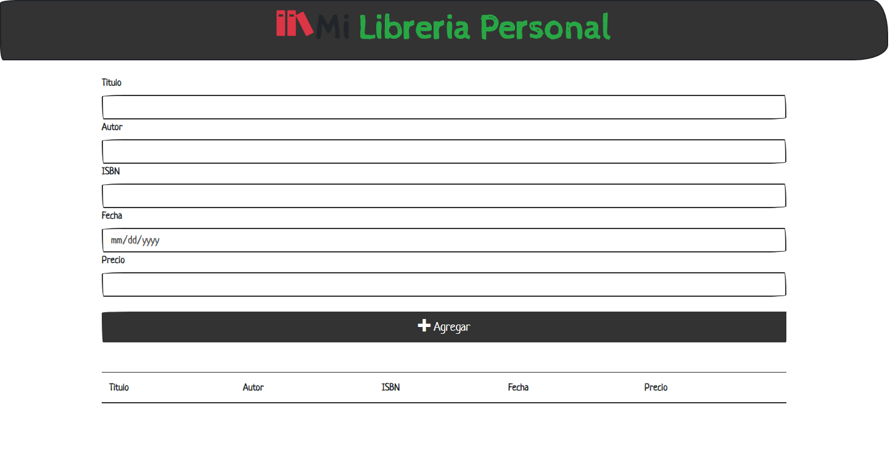

# A simple Book list using TS

This is one of my first projects made on javascript and now I refactored using typescript with some news features added as the **Alerts** for example.

### How to open the project after cloning

Locate the root directory of the project and open your terminal, type

```javascript
npm install //This is going to install all the dependencies
```

And later, run this another command

```
parcel ./index.html
```

That will open a port on 1234 in the localhost route. the project will looks like this 
